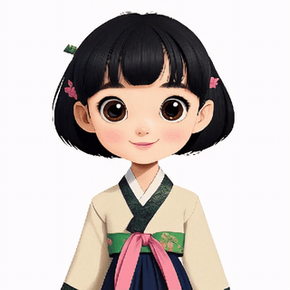
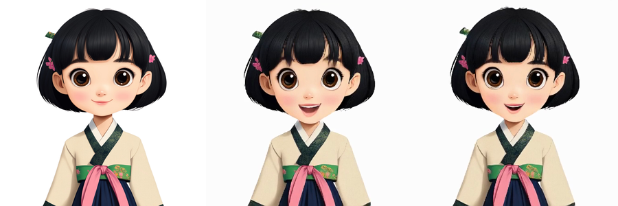
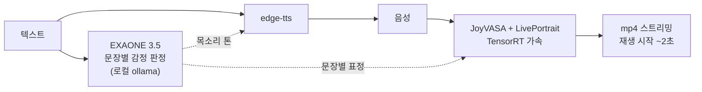
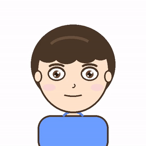
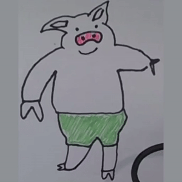
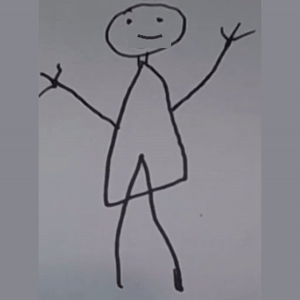

<div align="center">

# Talking Drawing Avatar

그림·사진에 목소리와 표정을 입히는 로컬 아바타 엔진

[](https://www.python.org/)
[](https://fastapi.tiangolo.com/)
[](https://pytorch.org/)
[](https://developer.nvidia.com/tensorrt)
[](https://ollama.com/library/exaone3.5)



*"정말 축하드려요! → 화가 나요. → 허전하네요." — 그림 한 장과 텍스트만 입력.
문장마다 감정이 판정되고, 입이 실제로 벌어진다.*



*왼쪽이 원본. 원본은 입을 다물고 있다 — 벌어진 입과 이는 생성된 픽셀이다.*

</div>

---

## 동작 방식



한 문장씩 감정을 판정해 목소리 톤과 얼굴 두 곳에 싣는다. 얼굴 쪽은 렌더된 영상에
덧그리는 게 아니라 LivePortrait 의 표정 벡터에 직접 더하므로 고개가 움직여도 어긋나지
않는다. 문장 경계는 0.25초 크로스페이드.

지연을 줄이는 장치가 둘 있다.

- 감정 판정과 TTS 를 동시에 돌린다. 감정이 TTS 를 막는 유일한 이유는 SSML 프로소디인데,
  중립으로 합성해 두고 판정이 오면 같은 값을 ffmpeg 로 입힌다. edge-tts 의 pitch 가
  절대 Hz 오프셋이라 리샘플 배율이 1.14 를 넘지 않고, 실측에서 포먼트 이동은 관측되지 않았다.
- 다 만들기 전에 재생을 시작한다. 프레임이 나오는 대로 프래그먼트 mp4 로 흘려보낸다.

## 두 경로

스프라이트를 아무리 변형해도 다문 입 그림에는 벌어진 입 안쪽 픽셀이 없다. 이·혀·구강은
만들어 넣는 수밖에 없고, 그게 위의 생성 영상 경로다. 즉답이 필요하거나 얼굴 검출이 안
되는 그림은 실시간 퍼펫 경로가 받는다.

| | 생성 영상 (메인) | 실시간 퍼펫 |
|---|---|---|
| 방식 | JoyVASA + LivePortrait 픽셀 생성 | 눈·입 스프라이트를 캔버스에서 변형 |
| 입 | 실제로 벌어짐 (이·혀·구강 생성) | 벌어지지 않음 (윤곽 변형만) |
| 반응 | 재생 시작까지 ~2초 | 즉시 (~0.5초) |
| 되는 그림 | 얼굴 검출이 되는 그림 (실사·포트레이트 일러스트) | 아무거나 |
| 얼굴 근육 | 눈썹 + 입꼬리 + 눈 크기 (+ 생성 모델의 자연 움직임) | ARKit 52채널 전부 |

어느 경로를 탈지는 등록할 때 정해진다. LivePortrait 의 얼굴 검출을 한 번 돌려
`manifest.json` 의 `video` 에 적는다. 검출이 안 되는 그림(손그림 전신 낙서 등)에 영상을
억지로 태우면 모델이 그림 전체를 얼굴로 착각해 통째로 늘리기 때문에, 그런 그림은
퍼펫 경로만 쓴다.

실측으로는 실사와 포트레이트 일러스트가 통과하고, 손그림 전신은 머리만 잘라 넣어도
검출이 안 된다. 자동 크롭으로 구제가 안 되는 이유다. 둘 다 가능한 캐릭터는 화면의
`출력` 라디오로 직접 고른다.

<div align="center">
  

*실시간 퍼펫 경로 — 검출이 안 되는 낙서도 즉시 말한다.*
</div>

## 기능

- 한국어 TTS(edge-tts) 발화. 음성에 맞춰 입과 얼굴 근육이 움직인다
- EXAONE 3.5 가 문장마다 감정을 판정해 목소리 톤과 표정에 싣는다. 대화 모드에서는 응답과 감정이 같이 온다
- 아무 그림이나 캐릭터로: 드래그앤드랍 후 4클릭(왼눈·오른눈·입 중심·입 영역).
  등록 없이 사진 하나만 시험하려면 드롭다운의 `임시 사진`
- 퍼펫 경로는 ARKit 52채널 블렌드셰이프 — NeuroSync(235M, 웜 0.3초) / NVIDIA Audio2Face-3D 선택
- 퍼펫의 입은 스프라이트 교체가 아니라 근육 채널 14개가 입 윤곽 제어점을 매 프레임 변형.
  입을 벌리면 턱선·볼도 그림째로 워핑(WebGL)
- GPU 없는 정적 데모: 브라우저 TTS + 한글 음절 분해로 서버 없이 동작 (`docs/`)

## 성능

RTX 4070 Ti, 4.7초 발화 기준. 영상 경로가 처음엔 말하기부터 재생까지 4.8초였다.

| | 걸린 시간 | 무엇을 |
|---|---|---|
| 시작 | 4.8s | — |
| TRT 렌더 | 3.3s | 전체의 66%를 먹던 warping+spade 만 TensorRT 로 교체 (24.6 → 15.5 ms/frame) |
| 스트리밍 재생 | 2.3s | 다 만들고 트는 대신, 프레임이 나오는 대로 인코딩해 흘려보냄 |
| 감정 병렬화 | 2.1s | 감정 판정(0.39s)을 TTS(0.56s)와 동시에 |

전부 프로파일을 먼저 뜨고 고쳤다. 재보니 오히려 느려서 버린 것(배치 렌더: 36.0 vs
24.6 ms/frame)도 코드 주석에 남겨 두었다.

## 설치·실행

```bash
git clone https://github.com/ingon1026/talking-drawing-avatar && cd talking-drawing-avatar
uv venv --python 3.10 .venv
uv pip install --python .venv/bin/python fastapi 'uvicorn[standard]' edge-tts pillow librosa scipy \
    torch==2.2.2 --index-url https://download.pytorch.org/whl/cu121
.venv/bin/uvicorn app:app --host 0.0.0.0 --port 8000   # → http://localhost:8000/puppet
```

- JoyVASA(선택): 없으면 영상 경로가 잠기고 퍼펫만 동작한다 (`/api/health` 의 `joyvasa_ready`)
- EXAONE(선택): 로컬 ollama 에 `exaone3.5:2.4b`. 없으면 감정 없이 중립으로 동작
- NeuroSync 가중치(게이트): [convaitech/NEUROSYNC](https://huggingface.co/convaitech/NEUROSYNC) 약관 동의 + `HF_TOKEN` 설정 후 첫 발화 때 자동 다운로드. 없으면 음량 기반 폴백
- NVIDIA A2F-3D(선택): C++/TensorRT 빌드 필요 — [Audio2Face-3D-SDK](https://github.com/NVIDIA/Audio2Face-3D-SDK) 절차 참조 (WSL2 + RTX 4070 Ti 검증)
- TRT 렌더 가속(선택, 1.4배): [`trt_warp.py`](trt_warp.py) 참조. `$FLP_ROOT/checkpoints/liveportrait_onnx/warping_spade-fix.trt` 가 있으면 자동으로 켜진다 (`FLP_ROOT` 기본값 `~/FasterLivePortrait`)
  ```bash
  uv pip install --python .venv/bin/python --index-url https://pypi.nvidia.com \
      --extra-index-url https://pypi.org/simple --index-strategy unsafe-best-match \
      --no-deps tensorrt-libs==8.6.1 tensorrt-bindings==8.6.1
  ```
  `--no-deps` 는 의도적이다. 의존성을 따라가면 cudnn 9 가 깔려 토치의 cudnn 8.9 와 충돌한다.
  엔진은 GPU 아키텍처 종속(sm_89 에서 생성)이라 다른 GPU 에서는 FasterLivePortrait 의
  `scripts/all_onnx2trt.sh` 로 다시 뽑아야 한다. 없으면 torch 경로로 폴백한다
- 상시 실행은 systemd 유저 서비스로. HF Spaces 배포용 `Dockerfile` / `requirements-space.txt` 포함
- 외부 공유: `bash tools/share_tunnel.sh` 로 Cloudflare quick tunnel URL 생성. 인증이 없으니 아는 사람에게만

## 구조

```
├─ app.py                  # FastAPI 서버 (TTS·잡 큐·캐릭터 API·스트리밍)
├─ pipeline.py             # JoyVASA 래퍼 — 깜빡임·문장별 표정 주입, 얼굴 검출 판정
├─ trt_warp.py             # 렌더의 warping+spade 만 TensorRT 로 대체 (있으면 자동)
├─ llm_source.py           # EXAONE — 대화 + 문장별 감정 판정
├─ blendshape_source.py    # 음성 → ARKit 52ch (NeuroSync, 폴백 내장)
├─ a2f_source.py           # 음성 → ARKit 52ch (NVIDIA A2F-3D)
├─ character_builder.py    # 그림 → 퍼펫 캐릭터 (눈/입 분리·베이스 생성)
├─ static/avatar_core.js   # 렌더 코어 (docs/avatar_core.js 는 복사본 — 수정 후 cp 로 동기화)
├─ static/puppet.html      # 단일 서버 페이지 — 영상·퍼펫·3D 를 드롭다운으로 선택
├─ patches/                # JoyVASA 로컬 패치 (표정·깜빡임 주입 지점)
├─ docs/                   # 정적 데모 (서버리스)
├─ assets_characters/      # 캐릭터 에셋 (base/눈 스프라이트/manifest)
└─ tools/                  # 캐릭터 생성·계측 스크립트
```

캐릭터가 어느 경로를 타는지는 manifest 의 `video` 불리언으로 갈린다. 키가 없던 시절의
캐릭터는 `PYTHONPATH= .venv/bin/python tools/rejudge_video.py` 로 소급 판정한다
(기본 dry-run, 적용은 `--apply`).

## 라이선스

| 구성요소 | 라이선스 |
|---|---|
| 이 저장소 코드 | MIT ([LICENSE](LICENSE)) |
| JoyVASA·LivePortrait (영상 모드) | MIT — 단 InsightFace 검출 모델은 비상업 전용 |
| EXAONE 3.5 (감정·대화) | EXAONE AI Model License 1.1 — NC(비상업) |
| NeuroSync (벤더링·가중치) | 듀얼 — 연매출 $1M 미만 MIT / 이상 상업 허가 |
| NVIDIA Audio2Face-3D | SDK MIT / 모델 NVIDIA Open Model License |

데모 GIF 의 캐릭터는 [Pngtree](https://pngtree.com) 일러스트로 만들었다.

---

<sub>WSL2 · RTX 4070 Ti 에서 개발</sub>
