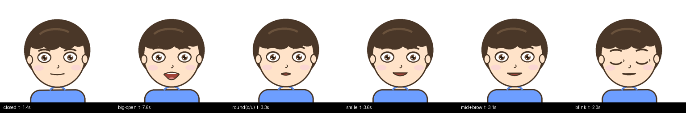
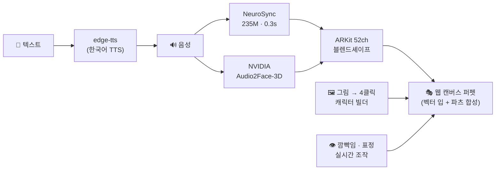

<div align="center">

# 🎨 Talking Drawing Avatar

**내가 그린 그림에 목소리와 얼굴 근육을 불어넣는 실시간 아바타 엔진**

[](https://ingon1026.github.io/talking-drawing-avatar/)
[](https://www.python.org/)
[](https://fastapi.tiangolo.com/)
[](https://pytorch.org/)
[](https://github.com/NVIDIA/Audio2Face-3D)

  

*기본 캐릭터부터 화이트보드 낙서까지 — 텍스트만 입력하면 말을 합니다.*

</div>

---

## ✨ 특징

- **텍스트 → 발화**: 한국어 TTS(edge-tts)로 문장을 말하고, 음성에 맞춰 입과 얼굴 근육이 움직임
- **ARKit 52채널 얼굴 근육**: 음성→블렌드셰이프 엔진 2종을 선택 사용
  - ⚡ **NeuroSync** (235M, 웜 추론 0.3초) — 실시간 대화용
  - 🟩 **NVIDIA Audio2Face-3D** (mark v2.3, WSL2 로컬 빌드) — 자연 깜빡임까지 생성
- **벡터 입 렌더링**: 입모양 스프라이트 교체가 아니라, 근육 채널 14개가 입 윤곽 제어점을 매 프레임 직접 변형 — 입꼬리 좌우 독립, 윗니·혀 노출, 무한 중간 단계
- **얼굴 메시 워핑**: 입을 벌리면 턱선·볼이 그림째로 변형 (WebGL 가우시안 변위장, 실패 시 자동 폴백)
- **감정 프리셋** 😐😊😢😠😲 + 캐릭터 추가/삭제 관리
- **눈깜빡임 완전 제어**: 즉시 깜빡 버튼 / 자동 깜빡임 간격 / 감김 슬라이더
- **아무 그림이나 캐릭터로**: 드래그앤드랍 → 4클릭(왼눈·오른눈·입 중심·입 영역) → 완성
- **GPU 없는 무료 데모**: 브라우저 TTS + 한글 음절 분해→입모양 타임라인으로 서버 없이 동작

<div align="center">


*한 문장 안에서의 실제 표정 변화 — 다뭄 · 크게 벌림(윗니/혀) · 오/우 오므림 · 미소 · 눈썹 · 깜빡임*
</div>

## 🏗 아키텍처



## 🖥 데모 vs 풀버전

| | 🌐 [정적 데모](https://ingon1026.github.io/talking-drawing-avatar/) | 💻 로컬 풀버전 |
|---|---|---|
| 서버 | 불필요 (GitHub Pages) | FastAPI + GPU |
| TTS | 브라우저 내장 (speechSynthesis) | edge-tts (선히/인준/현수) |
| 립싱크 | 한글 음절→입모양 타임라인 (근사) | **음성 기반 52채널 근육** (NeuroSync / A2F-3D) |
| 캐릭터 생성 | ✅ (세션 한정) | ✅ (영구 저장) |
| 요구 사양 | 아무 브라우저 | NVIDIA GPU (12GB 검증) |

## 🚀 로컬 풀버전 실행

```bash
git clone https://github.com/ingon1026/talking-drawing-avatar && cd talking-drawing-avatar
uv venv --python 3.10 .venv
uv pip install --python .venv/bin/python fastapi 'uvicorn[standard]' edge-tts pillow librosa scipy \
    torch==2.2.2 --index-url https://download.pytorch.org/whl/cu121
.venv/bin/uvicorn app:app --host 0.0.0.0 --port 8000   # → http://localhost:8000/puppet
```

- **NeuroSync 가중치**(게이트): [convaitech/NEUROSYNC](https://huggingface.co/convaitech/NEUROSYNC) 약관 동의 + `HF_TOKEN` 설정 → 첫 발화 때 자동 다운로드. 없으면 음량 기반 폴백으로 동작.
- **NVIDIA A2F-3D 엔진**(선택): C++/TensorRT 빌드 필요 — [`Audio2Face-3D-SDK/_project_build/SETUP.md`](https://github.com/NVIDIA/Audio2Face-3D-SDK) 절차 참조 (WSL2 + RTX 4070 Ti에서 검증).
- **JoyVASA 영상 모드**(선택): 등록 캐릭터와 드롭다운의 `📷 임시 사진` 이 이 경로를 탄다 — 입이 실제로 벌어지고 이·혀·구강이 화풍에 맞게 생성된다(웜 ~2초). 없으면 스프라이트 경로만 동작.
- **TRT 렌더 가속**(선택, 1.4배): [`trt_warp.py`](trt_warp.py) 참조. `$FLP_ROOT/checkpoints/liveportrait_onnx/warping_spade-fix.trt` 가 있으면 자동으로 켜진다
  (`FLP_ROOT` 기본값은 `~/FasterLivePortrait`).
  ```bash
  uv pip install --python .venv/bin/python --index-url https://pypi.nvidia.com \
      --extra-index-url https://pypi.org/simple --index-strategy unsafe-best-match \
      --no-deps tensorrt-libs==8.6.1 tensorrt-bindings==8.6.1
  ```
  `--no-deps` 는 일부러다 — 의존성을 따라가면 cudnn 9 가 깔려 토치의 cudnn 8.9 와 충돌한다.
  엔진은 **GPU 아키텍처 종속**(sm_89 에서 생성)이라 다른 GPU 로 옮기면 FasterLivePortrait 의
  `scripts/all_onnx2trt.sh` 로 다시 뽑아야 한다. 없으면 조용히 torch 경로로 돈다.
- 상시 실행: systemd 유저 서비스로 등록해 자동 기동 가능. HF Spaces 배포용 `Dockerfile` / `requirements-space.txt` 포함 (Docker Space는 HF PRO 필요).
- **로컬 풀버전을 남에게 보여주기**: `bash tools/share_tunnel.sh` → Cloudflare quick tunnel로 공개 URL 생성 (무료·계정 불필요). 대화·A2F 포함 전 기능이 그대로 공개된다. 내 PC가 켜져 있을 때만 접속되고 실행마다 URL이 바뀐다. 인증이 없으니 아는 사람에게만 공유.

## 📁 구조

```
├─ app.py                  # FastAPI 서버 (TTS·잡 큐·캐릭터 API)
├─ blendshape_source.py    # 음성 → ARKit 52ch (NeuroSync, 폴백 내장)
├─ a2f_source.py           # 음성 → ARKit 52ch (NVIDIA A2F-3D)
├─ character_builder.py    # 그림 → 퍼펫 캐릭터 (눈/입 분리·베이스 생성)
├─ trt_warp.py             # 영상 렌더의 warping+spade 만 TensorRT 로 대체 (있으면 자동, 1.4배)
├─ static/avatar_core.js   # 렌더 코어 (docs/avatar_core.js 는 복사본 — 수정 후 `cp static/avatar_core.js docs/` 로 동기화)
├─ static/puppet.html      # 유일한 서버 페이지 — 스프라이트·영상·3D 세 경로를 드롭다운으로 고른다
├─ docs/                   # GitHub Pages 정적 데모 (서버리스 버전)
├─ assets_characters/      # 캐릭터 에셋 (base/눈 스프라이트/manifest)
└─ tools/                  # 캐릭터 생성 스크립트
```

## ⚖️ 라이선스 유의사항

| 구성요소 | 라이선스 |
|---|---|
| 이 저장소 코드 | MIT ([LICENSE](LICENSE)) |
| NeuroSync (벤더링·가중치) | 듀얼 — 연매출 $1M 미만 MIT / 이상 상업 허가 |
| NVIDIA Audio2Face-3D | SDK MIT / 모델 NVIDIA Open Model License |
| JoyVASA·LivePortrait (영상 모드) | MIT — 단 InsightFace 검출 모델은 **비상업 전용** |

---

<div align="center">
<sub>WSL2 · RTX 4070 Ti에서 개발 — 낙서도 배우가 될 수 있습니다 🐷</sub>
</div>
